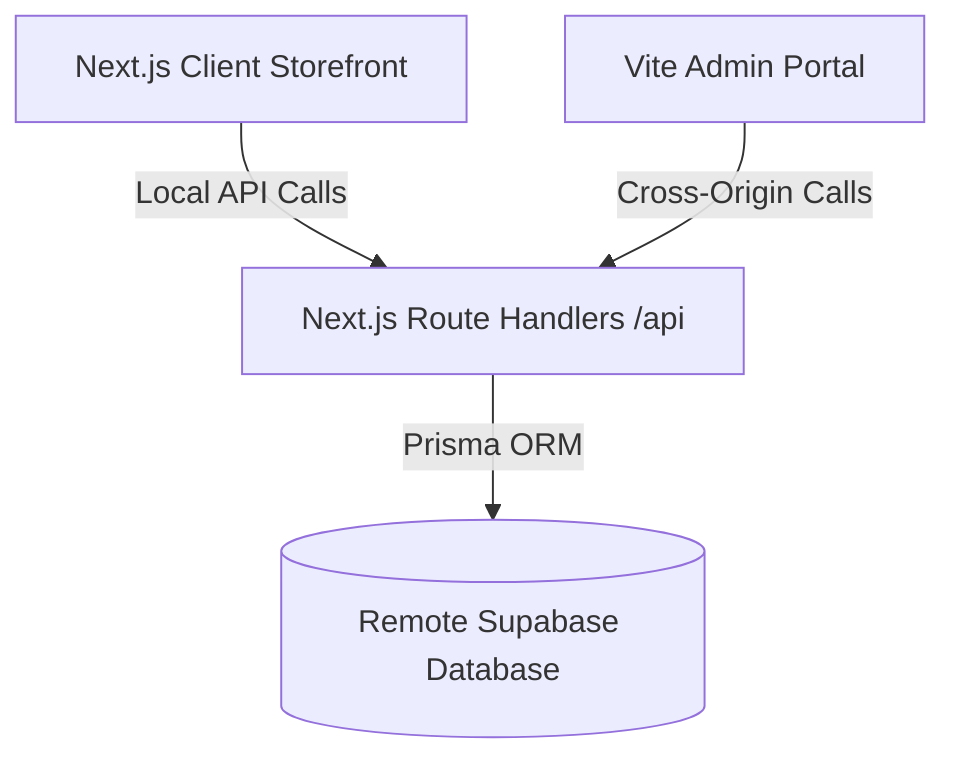

# Next.js Full-Stack Backend Integration Plan

This plan details the migration of the Express Node.js backend REST API endpoints directly into the Next.js App Router as native **Route Handlers** (`src/app/api/...`). 

By converting the backend into Next.js routes and hosting the entire project at the root level, we resolve all Vercel deployment issues, bypass CORS policies entirely, and create a single-command launch pipeline.

---

## Proposed Architectural Restructuring

### Key Changes
1. **Frontend Relocation**: Move all Next.js code (`src/`, `public/`, `tsconfig.json`, `tailwind.config.ts`, `postcss.config.js`) from the `client/` subdirectory back to the workspace root directory.
2. **Backend Decommissioning**: Deprecate the `server/` Express folder. All models, routes, services, and middlewares will be implemented as native Next.js helpers and route handlers.
3. **Database Integration**: Place `prisma/` at the root folder, and instantiate a Next.js-compatible Prisma Client singleton.

---

## Proposed Changes

### [Root Workspace Configuration]

#### [NEW] [next.config.js](file:///c:/Users/shanm/.gemini/antigravity/scratch/miracle/next.config.js)
Configuration enabling strict mode, image optimization domains (Cloudinary, Unsplash), and standard Web routing compatibility.

#### [MODIFY] [package.json](file:///c:/Users/shanm/.gemini/antigravity/scratch/miracle/package.json)
Install backend dependencies at the root workspace:
- `@prisma/client`, `bcryptjs`, `jsonwebtoken`, `nodemailer`, `pdfkit`, `stripe`, `razorpay`
- `@types/bcryptjs`, `@types/jsonwebtoken`, `@types/nodemailer`, `@types/pdfkit`

#### [NEW] [tsconfig.json](file:///c:/Users/shanm/.gemini/antigravity/scratch/miracle/tsconfig.json)
Standard Next.js App Router configuration. Excludes only `admin-portal/` and `db-temp/`.

---

### [Next.js Route Handlers (API Endpoints)]

#### [NEW] [prisma.ts](file:///c:/Users/shanm/.gemini/antigravity/scratch/miracle/src/models/prisma.ts)
Prisma Client singleton to prevent database connection limits under Next.js development hot-reloads.

#### [NEW] [auth.ts](file:///c:/Users/shanm/.gemini/antigravity/scratch/miracle/src/middleware/auth.ts)
A Next.js authentication guard helper function `verifyAuth(req: Request)` that decodes bearer tokens from headers and returns the authenticated user object.

#### [NEW] [route.ts](file:///c:/Users/shanm/.gemini/antigravity/scratch/miracle/src/app/api/auth/register/route.ts)
* `POST /api/auth/register` (User registrations)

#### [NEW] [route.ts](file:///c:/Users/shanm/.gemini/antigravity/scratch/miracle/src/app/api/auth/login/route.ts)
* `POST /api/auth/login` (Standard credentials login)

#### [NEW] [route.ts](file:///c:/Users/shanm/.gemini/antigravity/scratch/miracle/src/app/api/auth/profile/route.ts)
* `GET /api/auth/profile` (Retrieve user profile details)
* `PUT /api/auth/profile` (Update user details)

#### [NEW] [route.ts](file:///c:/Users/shanm/.gemini/antigravity/scratch/miracle/src/app/api/products/route.ts)
* `GET /api/products` (Product browsing with pagination, price, and category filters)

#### [NEW] [route.ts](file:///c:/Users/shanm/.gemini/antigravity/scratch/miracle/src/app/api/products/metadata/route.ts)
* `GET /api/products/metadata` (Fetch distinct categories and brands for filtering UI)

#### [NEW] [route.ts](file:///c:/Users/shanm/.gemini/antigravity/scratch/miracle/src/app/api/products/[slug]/route.ts)
* `GET /api/products/[slug]` (Fetch individual product details)

#### [NEW] [route.ts](file:///c:/Users/shanm/.gemini/antigravity/scratch/miracle/src/app/api/cart/route.ts)
* `GET /api/cart` (Retrieve cart items)
* `POST /api/cart` (Add items to cart)
* `PUT /api/cart` (Adjust item quantity)
* `DELETE /api/cart` (Remove item / clear cart)

#### [NEW] [route.ts](file:///c:/Users/shanm/.gemini/antigravity/scratch/miracle/src/app/api/orders/route.ts)
* `GET /api/orders` (Fetch customer order history)
* `POST /api/orders` (Process checkout, deduct stock, create payment record)

#### [NEW] [route.ts](file:///c:/Users/shanm/.gemini/antigravity/scratch/miracle/src/app/api/admin/dashboard/route.ts)
* `GET /api/admin/dashboard` (Analytics dashboard containing sales, orders, and products counts)

---

## Verification Plan

### Automated Verification
1. Run `npm run build` at the root workspace directory to compile the Next.js pages and API routes.
2. Run database migrations and seeding tests locally to verify prisma integrity.

### Manual Verification
1. Open the storefront on `http://localhost:3000` and check checkout flow, user logins, and cart updates.
2. Open the Admin portal on `http://localhost:3001` and verify that inventory adjustments, analytics loading, and product creation function against the new Next.js routes.
